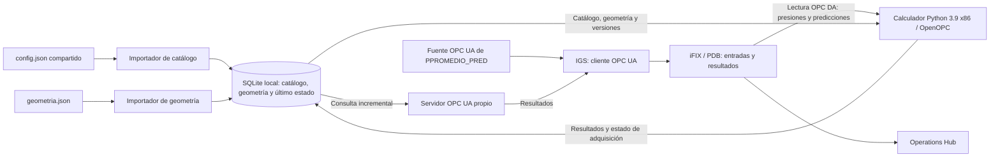

# Arquitectura y flujo de información

[Inicio](../README.md) · [Modelo de datos](modelo_datos.md) · [Decisión SQLite](decisiones/001-sqlite-compartido.md)

## Alcance acordado

Todos los procesos propios, SQLite, IGS e iFIX se ejecutarán en el mismo equipo
y bajo el mismo usuario. No se planea acceso de otros dispositivos a los
componentes propios. La fuente OPC UA de predicciones es un sistema ajeno a
este proyecto: se conserva su conexión existente y no se implementa aquí.

El equipo informado es Windows Server 2019 Datacenter 1809, 16 GB RAM y Xeon
Gold 6278C. Los valores informados de 41 % de RAM y aproximadamente 50 % de CPU
son referencias puntuales, no mediciones de capacidad disponible garantizada.

## Flujo objetivo — planificado



Las flechas representan datos, no quién inicia una conexión. El calculador inicia
lecturas OPC DA; IGS inicia conexiones/lecturas/suscripciones UA; el servidor
propio consulta SQLite. El recorrido de vuelta a iFIX no debe crear dependencia
del cálculo respecto de sus propios resultados.

No hay HTTP ni Named Pipes en el intercambio propio. OPC UA conserva su endpoint
TCP local para IGS, con puerto configurable y disponibilidad por verificar.

## Estado ejecutable actual

Existen funciones de parser, lectura OPC DA, cálculo y escritura OPC DA. Las
pruebas las integran con un cliente falso. `python_scheduler/main.py` solamente
imprime `Main`; no coordina procesos ni ciclos. Existe infraestructura SQLite con
esquema v3, catálogo/geometrías, importadores, resultados, snapshots, consola y
migración con backup. Todavía no hay servidor OPC UA ni coordinador operativo.
Existe además `servidor_opcua/` con modelo lógico de nodos y preparación pura
de disponibilidad/valores. No implementa transporte ni escucha en ningún puerto.

La escritura actual del código tiene como destino directo iFIX. En el objetivo,
el calculador guardará en SQLite y el servidor publicará hacia IGS/iFIX. Mantener
ambas salidas como opción requerirá estados de entrega independientes; no se
activará doble publicación por defecto.

La geometría hoy se obtiene de tags OPC DA. La integración futura sustituirá esa
fuente por SQLite. `calculos.py` seguirá recibiendo números, sin conocer la fuente.

## Responsabilidades objetivo

| Componente | Responsabilidad |
|---|---|
| Importadores | Validar archivos completos y activar cambios transaccionales |
| Biblioteca de almacenamiento | Validación del contrato, versiones, revisiones y transacciones |
| Calculador | Leer iFIX, validar calidad, calcular y guardar paquetes |
| SQLite | Catálogo importado, geometría activa y último estado confirmado |
| Servidor OPC UA | Publicar el estado y su disponibilidad; inicialmente solo lee la base |
| IGS/iFIX | Consumir los nodos y mantener los nombres PDB actuales |
| Operations Hub | Consumir la información mediante iFIX |

Los futuros scripts serán productores de variables distintas. PPROMEDIO y
LINEPACK tendrán un único productor responsable. Permitir escrituras desde
iFIX/OPC UA queda fuera de la primera versión y requiere definir su autoridad.

## Tiempo, unidades y disponibilidad

- Ciclo actual previsto: 30 segundos. Predictivo: 600 segundos.
- Actual: presiones en barg, diámetro exterior en pulgadas, espesor en mm,
  longitud en m. PPROMEDIO en bar absolutos, LINEPACK en Sm³.
- PPROMEDIO_PRED llega ya en bar absolutos. Cada linepack conserva su posición.
- Predicción: 72 posiciones separadas por una hora. Falta confirmar si la primera
  corresponde a la hora actual o siguiente y cómo se identifica la fecha inicial.
- Good se exige por defecto; su desactivación es una opción explícita.
- Un resultado persistido no es necesariamente vigente ni consumido por iFIX.
- Reiniciar puede dejar resultados no disponibles hasta obtener entradas válidas.

## Escalabilidad y recursos

Referencia observada del config revisado: 51 tramos, 215 tags actuales únicos
en la ruta OPC anterior, 102 salidas actuales y 3672 valores por serie predictiva.
Al pasar geometría a SQLite cambiará el conjunto de entradas OPC actuales.

Se proponen 51 arrays predictivos UA de 72 valores, no 3672 nodos individuales.
La compatibilidad del array con AR/IGS debe verificarse. No se fijan NodeIds finales
antes de esa prueba; serán estables y derivados de ID/base-tag, sin depender del
orden del catálogo. Los nombres PDB existentes se conservan.

Para contener carga: último estado sin histórico, consultas por revisión,
transacciones breves, conexiones reutilizadas y logs rotativos. No crear un hilo
o proceso por tramo. No bloquear el bucle UA con consultas o esperas prolongadas.
El intervalo inicial de consulta SQLite propuesto es 1–2 segundos, configurable.

SQLite serializa escritores. El límite práctico depende de productores,
duración de transacciones, disco, sesiones UA e IGS, no solo de cantidad de tramos.
No hay benchmarks del diseño nuevo ni cifras garantizadas de CPU/RAM.

## Pendientes antes de integrar

- Fijar entorno Python x64 y versión de biblioteca UA.
- Definir namespace URI, NodeIds, endpoint, calidad/timestamps y mapeo IGS/AR.
- Comprobar permisos de directorio, runtime y endpoint bajo el usuario real.
- Definir límites de paquetes, timeout y reintentos de SQLite.
- Confirmar referencia temporal y actualización de las predicciones externas.
- Validar recuperación, obsolescencia y adquisición de calidad en iFIX.

## Estructura de almacenamiento implementada

`almacenamiento/`: conexiones, SQL v3, importaciones, migraciones y repositorio de resultados.
`administracion/__main__.py`: consola local explícita, sin OPC.
Sin dependencias OPC; importación de catálogo reutiliza el parser del calculador.
Verificada por tests de almacenamiento, importaciones y repositorio. Ver su
[API y limitaciones](almacenamiento.md). El diagrama superior sigue siendo el
flujo objetivo: ninguna flecha SQLite se conectó todavía al calculador o UA.
Las flechas JSON → importadores → SQLite sí están implementadas mediante API Python.
El repositorio guarda resultados y expone snapshots para productores/consumidores
de prueba. Las flechas calculador ↔ SQLite y SQLite → UA siguen pendientes de integración.

Etapa 3a implementada, comprobada con productor SQLite temporal:

```text
Snapshot completo → validación de contexto y vigencia → valores/fechas/estado
                                                     → adaptador UA (pendiente)
```

`servidor_opcua/nodos.py` define claves candidatas estables y nombres de negocio;
`publicacion.py` prepara resultados sin modificar SQLite. Ver [contrato](publicacion_opcua.md).

## Estructura restante, todavía no creada

```text
servidor_opcua/    main.py, configuracion.py, adaptador UA, requirements.txt
configuracion/    aplicacion.ejemplo.json, geometria.ejemplo.json
```

La documentación se crea antes de esas implementaciones. Su introducción deberá
actualizar este estado, el modelo de datos y los comandos operativos.
